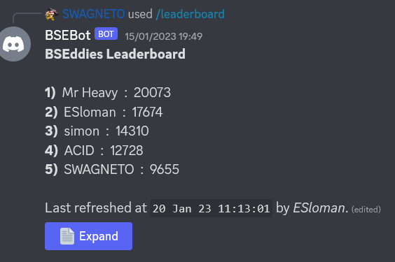
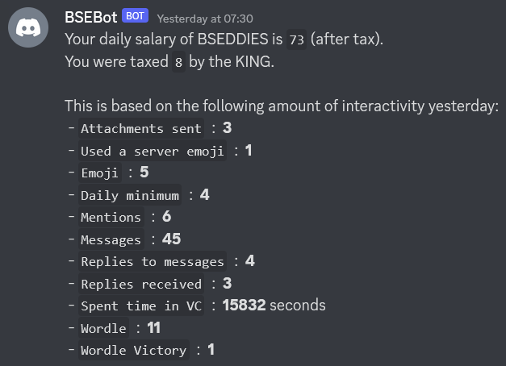
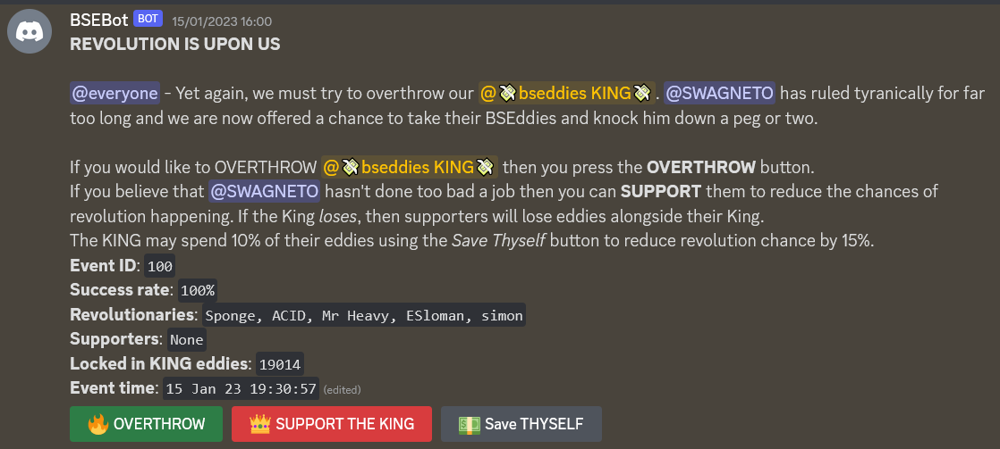
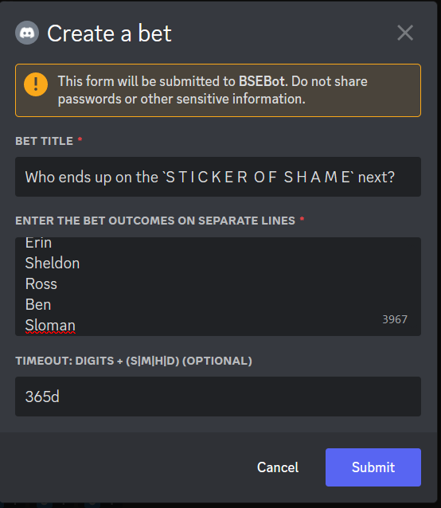
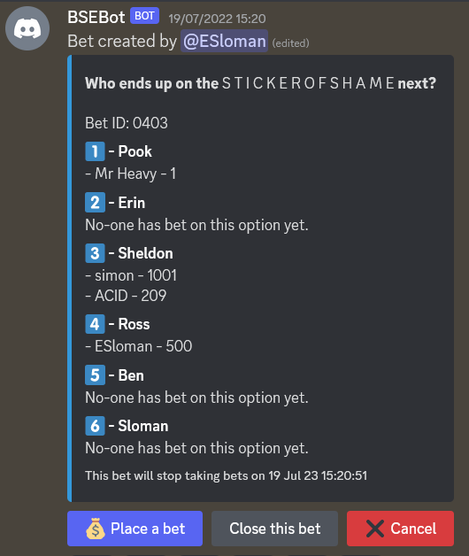
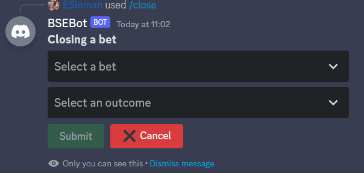
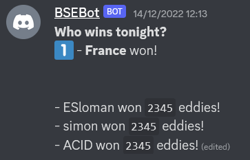
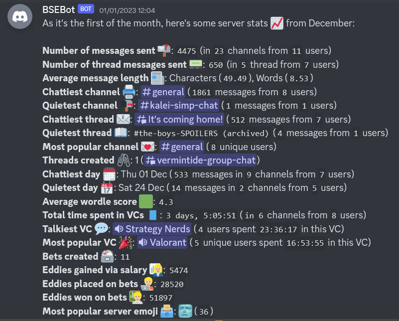
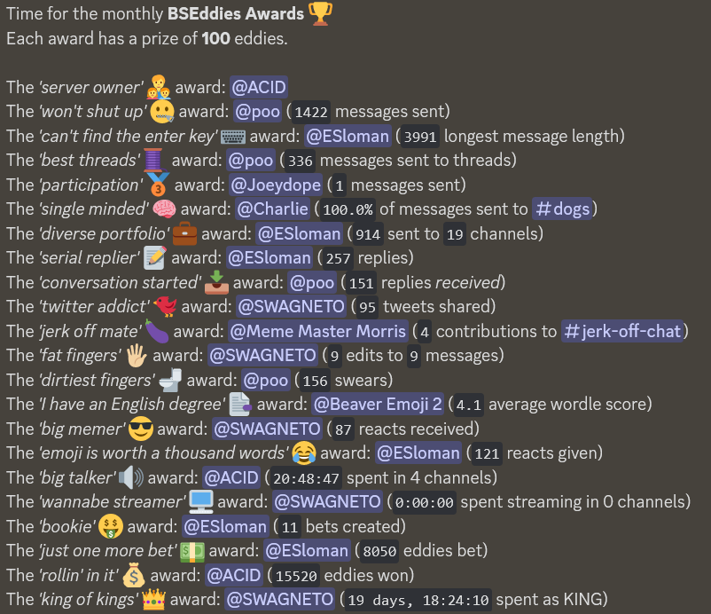

# bsebot      

**`bsebot`** is a Discord bot that provides a user economy and betting system for a server. Users again `eddies` (points), each day and can also create bets to spend their eddies on. The user with the highest amount of eddies is the **`KING`** of the server - the King gets a special role and earns taxes on other users' earnings.

Bot was originally created for the `BSE` server to fulfill a need to have something similar to _twitch predictions_ for placing bets on the server's games of Valorant. The bot has become a bit more generic and has other functions that are specific for the `BSE` server. The bot is capable of doing a `BSEddies awards` on a monthly or annual basis and also some server statistics.

**NOTE**: The aim is to make the code more server agnostic so that it can be invited to other servers. Will add an invite link here once that's been completed. Issue #79 captures that work.

# Features
- # Eddies

    ## view your eddies
    Use `/view` to see how many eddies you have

    

    ## check the leaderboard
    See how you stack up against other users in the server using `/leaderboard`

    

    ## earn eddies
    Earn eddies daily through interacting with the server.

    

    ## become the **King**
    Whoever has the most eddies - is the King! They get a special named role and will earn taxes on everyone's salaries.

    

    ## `R E O V L U T I O N`
    Will the peasants overthrow the KING? Will the KING consolidate further power?

    

- # Betting system

    Create bets and spend your eddies to lose it all or win **big**.

    ## Create bets

    Using `/create`

    

    

    ## Place eddies on those bets

    Using `/place` users can easily put their eddies onto bets. Users can also use the `place` button on the bet to invoke the same UI.

    

    ## Close bets

    Use `/close` or the use the bet buttons to invoke the close dialog and give users their payouts.

    

    Bet message gets updated with who won what.

    

- # Awards and statistics

    Get monthly and annual stats and awards.

    ## Statistics
    Get stats updates on the first of month and year.

    

    ## Awards
    Win monthly/annual awards and win some extra eddies.

    
