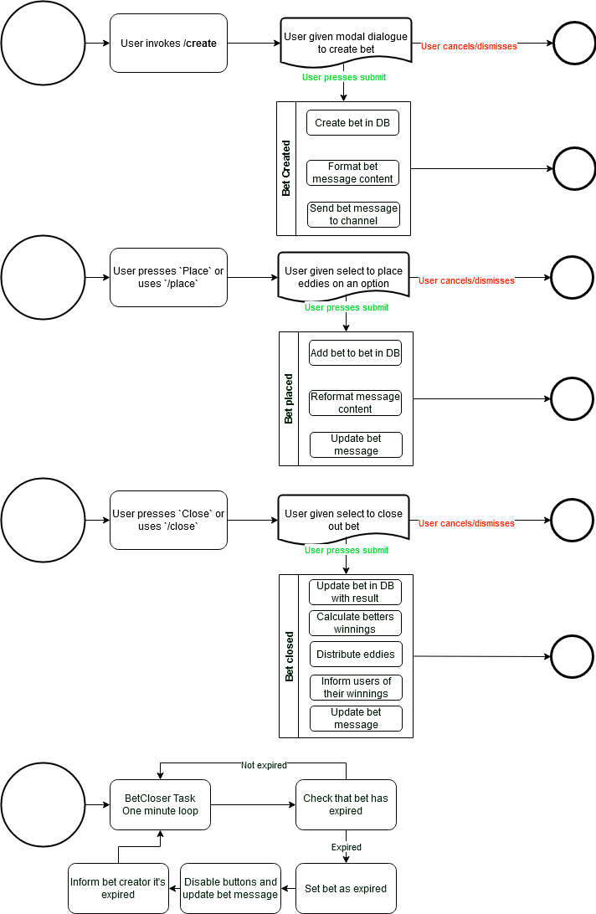
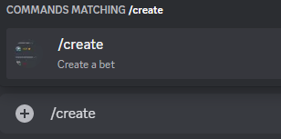
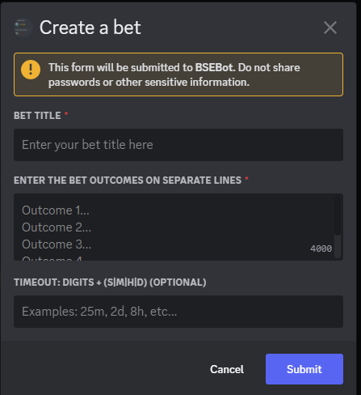
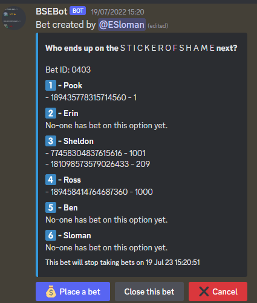
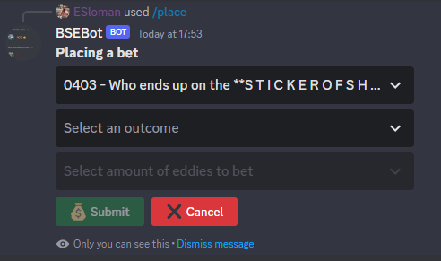

# Bet Lifecycle

Looking at the "lifecycle" of a bet is interesting for a few reasons:
1. bets and eddies is _the_ reason why the bot exists in the first place
2. understanding how bets are created and closed
3. there's lots of different components with bets so it gives us a good overview of everything

Components involved include:
- using Application Commands
- using Discord Modal Dialogues
- using Discord UI views with buttons
- using Discord UI views with select menus
- using Discord UI callbacks from buttons/menus
- using a task for checking expired bets
- database interactions

## Overview

 

### Creating the bet

This is a simple overview that describes how a user interacts with a given bet.
It doesn't factor in input validation or the user cancelling or the UI views timing out.

1. user creates a bet using `/create` slash command

2. user given a modal to fill in

3. user submits the modal
4. bot creates the bet in the DB
5. bot posts the bet as a message

### Placing eddies on the bet

1. user presses the **Place** button or uses the `/place` command

2. user selects options and then pressed submit
3. bot updates the DB
4. bot updates the bet message

### Closing the bet

Only the bet creator can close the bet.

1. user presses the **Close** button or uses the `/close` command
2. user selects options and then pressed submit
3. bot calculates winnings
4. bot distributes eddies
5. bot informs users of their winnings
5. bot updates the bet message