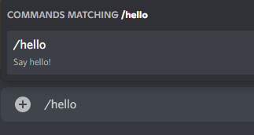
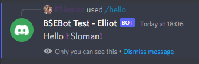

# Adding a new Slash Command

We're going to attempt to add an entirely new Slash Command to the bot. Obviously, we won't merge it into production but this should show how to do it and help in understanding how everything is structured. The Slash Command we're going to be creating will simply be called 'hello' and return a 'Hello World!' message.

## Requirements 

We're going to assume that you've done all the initial setup in `contributing.md` and can run the code locally with a test bot ID.


## Step 1: Creating the git branch

As we're going to be making changes - let's create a new branch and add our changes there. Call it whatever you're want - I'm going to go with _tutorial_one_.

````sh
git checkout -b tutorial_one
````

The above command creates a new local branch and also checks it out for you.

## Step 2: Creating the Slash Command class

Let's create the 'Slash Command Class' for our new Slash Command.

Every Slash Command has a corresponding class in `slashcommandeventclasses.py`. We'll put the logic in there. Open up the file and scroll to the very bottom - create a new class and call it `Hello`. We'll have it inherit from the base `BSEddies` class too. Then create the `__init__` method and add our standard args. Use these args in the `super` call. You should end up with something looking like this:

````python
class Hello(BSEddies):
    """
    Class for handling `/hello` commands
    """

    def __init__(self, client, guilds, logger, beta_mode=False):
        super().__init__(client, guilds, logger, beta_mode=beta_mode)
````

Now, we can add the `hello` method that we'll invoke when someone uses the `/hello` command. This will need to a coroutine as it'll be calling other coroutines; make sure to add the `async` keyword before the `def` to do this. The method will only need two arguments:
- self
- ctx

`self` is standard for any class method - it allows the method to access class variables and methods.

`ctx` will be our Application Context. This context is the information that Discord provides us about who invoked the command and where. If you are familiar with type hints and wish to add these - then the method will be returning `None` and the `ctx` is of type `discord.ApplicationContext`. You may end up with something looking like:

````python
class Hello(BSEddies):
    """
    Class for handling `/hello` commands
    """

    def __init__(self, client, guilds, logger, beta_mode=False):
        super().__init__(client, guilds, logger, beta_mode=beta_mode)
    
    async def hello(self, ctx: discord.ApplicationContext) -> None:
        pass  # passing for now so there's no error in the IDE
````

Now, let's add some _actual_ functionaliy. [We can refer to the docs](https://docs.pycord.dev/en/stable/api.html#discord.ApplicationContext) to see what we can do with our `ctx` variable. It has a `channel` property that we can use to send a message back to the user who sent it. However, it also has a `respond` method that we can use which is far cleaner. Let's use that to reply to the user who invoked our command. We can also grab the user object from `ctx` too and use that to get the user's discord name - which we can subsequently use in our reply. Putting that together, you should end up with something like:

````python
class Hello(BSEddies):
    """
    Class for handling `/view` commands
    """

    def __init__(self, client, guilds, logger, beta_mode=False):
        super().__init__(client, guilds, logger, beta_mode=beta_mode)
    
    async def hello(self, ctx: discord.ApplicationContext) -> None:
        """Sends a 'hello' message back to the channel this command was invoked in.

        Args:
            ctx (discord.ApplicationContext): the interaction context
        """

        user = ctx.author

        message = f"Hello {user.display_name}!"
        await ctx.respond(content=message, ephemeral=True)
````

Notice that I `awaited` the `respond` method as it is also a coroutine. When using `respond`, we have to explicitly set the 'content' (AKA, message content), and we also have the option to send the message ephemerally or not. If we set `ephemeral` to True, only the user who invoked the command will see it, otherwise the message will be sent to the channel and everyone can see it. _Generally_, I try to send most messages `ephemerally` unless the nature or functionality of the command needs the message to be seen by everyone (like bets, leaderboards, etc).

Additionally, instead of using `user.display_name`, we could have used `user.mention` if you wanted to _tag_ the user in the message as well.

That's the logic defined - let's connect it up.

## Step 3: Registering the Slash Command

The rest of what we'll do will be in the `commandmanager.py` file - open that up. In the `__init__` method of the `CommandManager` class, we define all of the Slash Command classes. Let's add our new class to the imports at the top of the file and then let's add ours to the list.

At the top:

````python
from discordbot.slashcommandeventclasses import Hello
````

And in the `__init__`:

````python
self.hello = Hello(client, guilds, self.logger, self.beta_mode)
````

Now we must make sure that our new command actually gets registered. In this class, we have a `_register_slash_commands` method. This is responsible for adding the slash commands. Head to this method and add it to the bottom of all the others. Try to follow the syntax of the other commands.

You should end up with something like this:

````python
@self.client.command(description="Say hello!")
    async def hello(ctx: discord.ApplicationContext):
        """
        Slash command to say hello

        Args:
            ctx (discord.ApplicationContext): the interaction context
        """
        await self.hello.hello(ctx)
````

There a few things to note here:
- the decorator around the method tells Discord that this is a slash command. The `description` parameter is self-explanatory
- the function name will be the name of the slash command in Discord
- we've used `async` on the method definition to denote that this is a coroutine and call `await` on our `hello` method we created earlier (as it too - is a coroutine).

And that's it! We've connected all the dots. Let's give it a go.

## Step 4: Testing

Run the bot and head over to Discord. Pick a channel your test bot is running in and type `/hello`!



Invoke the command see what you get back!



It works!

## Step 5: Further work

You can play around with this and see what else you can do in the response to the user. Try perhaps using `user.mention` or sending the message non-ephemerally to see the differences.

Once you're done, you can switch back to the main branch or another branch you're working on.

**Additional reading**
- You can read more about f-strings in Python [here](https://docs.python.org/3/tutorial/inputoutput.html)
- You can read more about type hints in Python [here](https://docs.python.org/3/library/typing.html).
- You can read more about `asyncio` and concurrency in Python [here](https://docs.python.org/3/library/asyncio.html).