# Adding a new Client Event

We're going to be adding a new client event to the bot. I currently have an issue, (#140 - [here](https://github.com/ESloman/bsebot/issues/140)), that adds a 'on_message_edit'
client event. We're going to add the basics of that here so we can see how that's done.

## Requirements 

We're going to assume that you've done all the initial setup in `contributing.md` and can run the code locally with a test bot ID.

## Step 1: Create the branch

We should always create a new branch when working on something new so let's do that.

````sh
git checkout -b on_message_edit
````

## Step 2: Investigation

So what do we need to do and how do we do it?
Well, we know that our bot receives events from discord - and we can register event listeners to these events to 'handle' them.
Okay, well we know that we want to do something when someone 'edits' a message, so let's have a look at which events we'll need to implement. Let's check the [docs](https://docs.pycord.dev/en/stable/api.html#event-reference)!

As we can see below, on the event reference, there's a 'Messages' section. Let's click on that.

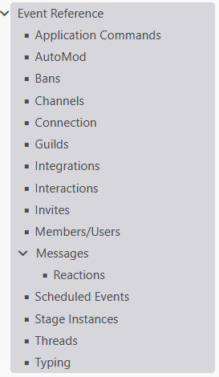

This looks like what we'd need.

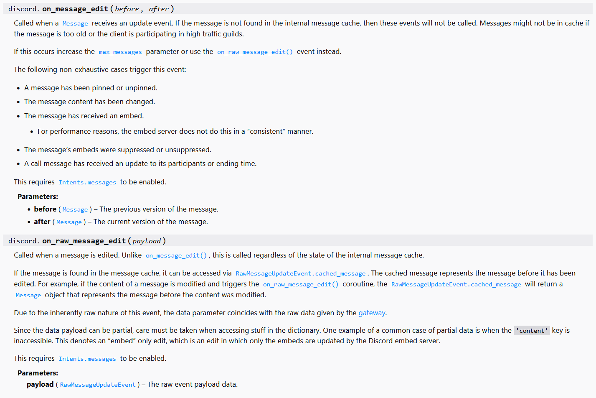

There are two events related to 'message editing'. **on_message_edit** and **on_raw_message_edit**. What's the difference?
Well, **on_message_edit** will only be triggered if the message being edited is in our local message cache, and the **on_raw_message_edit** will be triggered for _every_ message edited, regardless of it's cached status.

Let's not worry about that too much for now - let's implement the first one and go from there.

## Step 3: Creating the client event class

As we know, every event has a corresponding 'ClientEvent' class. These are located in the `discordbot/clienteventclasses` folder. 

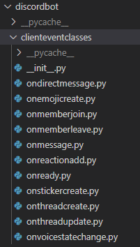

Let's create a new file in here called `onmessageedit.py`. Let's take a quick peek at `onmessage.py` first - as we'll use some of this framework for what we're about to do.

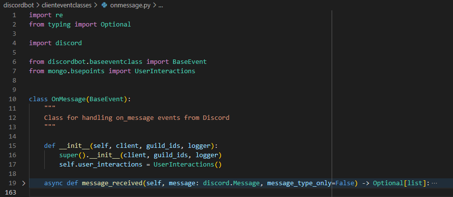

As we can see, we've got a class called `OnMessage` that inherits from a base class called `BaseEvent`.
There's then a pretty simple constructor that takes a client, guild_ids and a logger parameter. It passes them all to the super call and defines a `user_interactions` variable. Then we have the actual function - which we won't both with for now. Let's base our new client event on this framework.

```python
import discord

from discordbot.baseeventclass import BaseEvent

class OnMessageEdit(BaseEvent):
    """
    Class for handling on_message_edit events from Discord
    """

    def __init__(self, client, guild_ids, logger):
        super().__init__(client, guild_ids, logger)
    
    async def message_edit(self):
        pass
```

Okay, there's the basics. What parameters are we going to need to give to `message_edit`? Let's look at the docs again!

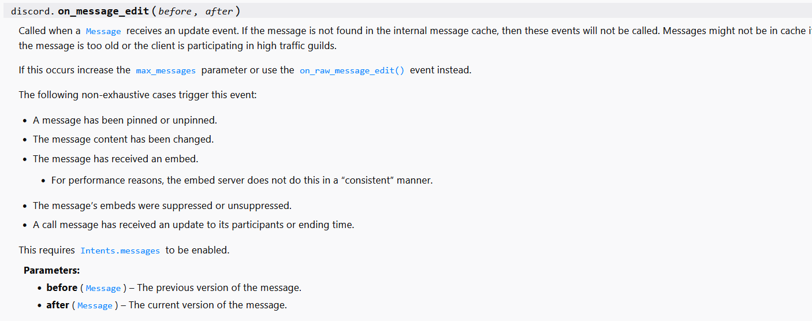

As we can see, we're given a `before` and `after` param - where each one is a Message type. Let's implement that.

```python
import discord

from discordbot.baseeventclass import BaseEvent

class OnMessageEdit(BaseEvent):
    """
    Class for handling on_message_edit events from Discord
    """

    def __init__(self, client, guild_ids, logger):
        super().__init__(client, guild_ids, logger)
    
    async def message_edit(self, before: discord.Message, after: discord.Message) -> None:
        pass
```

There you go. I've added the parameters with type hints.

Now, let's just send a message back to the channel when a message gets edited.

```python
import discord

from discordbot.baseeventclass import BaseEvent

class OnMessageEdit(BaseEvent):
    """
    Class for handling on_message_edit events from Discord
    """

    def __init__(self, client, guild_ids, logger):
        super().__init__(client, guild_ids, logger)
    
    async def message_edit(self, before: discord.Message, after: discord.Message) -> None:
        await after.reply(content=f"Message, `{after.id}` was just edited!")
```

Okay, that's the barebones for a client event class.

Note, the `discord.Message` type has a `reply` method that will reply to the message. It also has a `channel` property, which has a similar `send` method that could be used to send a message to the same channel the original message is in without necessarily replying to it.

## Step 4: Registering the event listener

Open up, `discordbot/clienteventclasses/__init__.py` and add our new event to the list. Following the formatting already in there.

```python
...
from .onmessage import OnMessage
from .onmessageedit import OnMessageEdit
from .onreactionadd import OnReactionAdd
...
```

Now, head over to `commandmanager.py` - you should be familiar with this if you have done the previous guide or done
any work on the bot before. It's the central hub of our bot's logic.

In the `_register_client_events` method, we need to add our event listener for the `on_message_edit` event. This is relatively simple, it can be deduced by the other entries in the function. But effectively, we're going to create a function within this method, and decorate it with the `@client.event` decorator to indicate that it's an event. The name of the function, will be the name of the event that we're listening for.

I went with the following:

```python
@self.client.event
async def on_message_edit(before: discord.Message, after: discord.Message):
    """Listens to the on_message_edit event

    Args:
        before (discord.Message): the message _before_
        after (discord.Message): _the message _after_
    """
    self.logger.info("someone has edited a message!")
```

I've added a log statement here for now - as there's something we need to do. We need to be able to run our method we created earlier from within this new function!
To do so, we must create an instance of the class. And before that, we need to _import_ our class. At the very top of the `commandmanager.py` file, is our imports. Add our new class to that in the appropriate location.

```python
# client events
from discordbot.clienteventclasses import OnDirectMessage, OnEmojiCreate, OnMemberJoin, OnMemberLeave
from discordbot.clienteventclasses import OnMessage, OnMessageEdit, OnReactionAdd, OnReadyEvent, OnStickerCreate
from discordbot.clienteventclasses import OnThreadCreate, OnThreadUpdate, OnVoiceStateChange
```

Then, in the `__init__` of the `CommandManager` class, let's create a new instance of our `OnMessageEdit` class.

```python
# client event classes
...
self.on_message = OnMessage(client, guilds, self.logger)
self.on_message_edit = OnMessageEdit(client, guilds, self.logger)
...
```

Great! Let's go back to the event listener and add calling our method.

```python
@self.client.event
async def on_message_edit(before: discord.Message, after: discord.Message):
    """Listens to the on_message_edit event

    Args:
        before (discord.Message): the message _before_
        after (discord.Message): _the message _after_
    """
    await self.on_message_edit.message_edit(before, after)
```
As you can see, I've replaced the log statement with the actual method call.

Let's give that a quick test and see what happens!

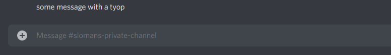

With the bot running locally, I've sent a message to a channel with a typo that I'm going to correct. Let's see what happens when I do so...

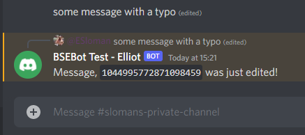

**Success**! As soon as our message was edited, the bot sent a reply saying that it was edited. Wonderful stuff.

## Step 5: Doing it Raw

Okay, let's circle back to that raw vs cached stuff we mentioned earlier. Let's stop the bot you have running and then restart it again. Once that's done, let's try to edit the original message we sent a few minutes ago.

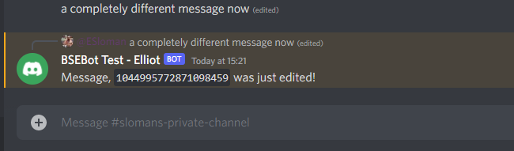

As you can see, nothing happened. I edited the same message to something different, but there's still only one reply. This is because, when we restarted, the message is no longer in the bot's local cache and therefore won't receive the `on_message_edit` event for that message. A lot of the different discord client events work this way - some only trigger if a particular interaction/message/whatever is in the cache (ie, the bot was online and listening when it was sent/done and hasn't cleared it from it's cache over time). It may be intended behaviour to ignore old stuff not in the cache - great! You don't need to worry about this section of the guide. But, I would like consistent behaviour for this kind of interaction.

We can take inspiration for how we proceed from the `on_raw_reaction_add` client event listener. We handle our `on_reaction_add` in a way that's similar to what we've done here and we leave it be. We then add the `on_raw_reaction_add` event listener but when we receive an event like that, we use the API to retrieve the information we do need and then call the same class method that `on_reaction_add` will call anyway. The only caveat, is we need to make sure that `on_raw_reaction_add` ignores events that `on_reaction_add` will also trigger for.

Let's put this in to practice to see what I mean. Create a new event listener for `on_raw_message_edit` in `commandmanager.py`.

```python
@self.client.event
async def on_raw_message_edit(payload: discord.RawMessageUpdateEvent):
    """Raw event for message edit events.

    Args:
        payload (discord.RawMessageUpdateEvent): the payload
    """
    cached_messages = self.__get_cached_messages_list()
    if payload.message_id in cached_messages:
        # message id is already in the cache
        return
    
    self.logger.info(payload)
```

As you can see here, we use `self.__get_cached_messages_list` to get a list of all the message IDs in the cache - and then exit out of this function early if our `message_id` is in said cache. We know that anything that executes after this will only happen to messages not in our cache. Let's test that out! Start up your local bot.

I have my output window just behind discord - so I can see if anything is logged to the console. I sent a new message and edited it - the bot replied but nothing was logged (ie, our payload event didn't happen). Wonderful!

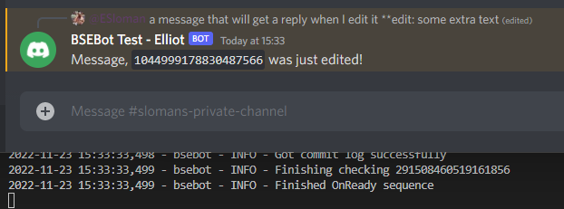

Now, let's edit the message from before to see what happens.

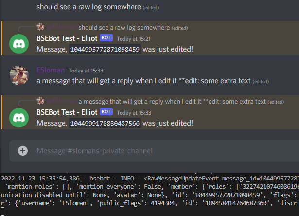

As you can see, editing the original message printed something to the output. This is the payload we would have gotten - we can also see what's in the payload object by looking at the documentation. Using the payload, let's get the `Message` object from the `message_id` and call our original `on_message_edit` class method.

```python
@self.client.event
async def on_raw_message_edit(payload: discord.RawMessageUpdateEvent):
    """Raw event for message edit events.

    Args:
        payload (discord.RawMessageUpdateEvent): the payload
    """
    cached_messages = self.__get_cached_messages_list()
    if payload.message_id in cached_messages:
        # message id is already in the cache
        return
    
    guild = self.client.get_guild(payload.guild_id)
    channel = await guild.fetch_channel(payload.channel_id)
    message = await channel.fetch_message(payload.message_id)
    await self.on_message_edit.message_edit(None, message)
```

As you can see, we gotta do a little bit of fetching to make sure we have everything we need. I'm using `fetch_channel` rather than `get_channel` as the channel _might_ not be in our cache properly. And then `fetch_message` as we _know_ that the message isn't in our cache. I can then call the `message_edit` method with `None` for before, (as we won't know it with a raw payload), and the `message` for after. Let's see what happens!

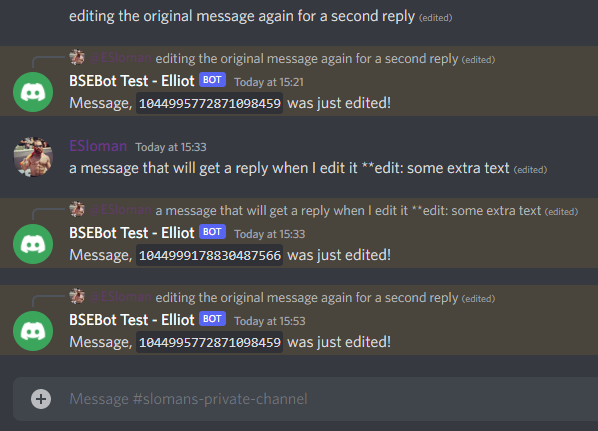

As you can see, editing the original message gives us a second reply! Everything is working as expected.

## Step 6: Further work and remarks

You can use this basic framework of:
- finding an issue/reason to use a new client event 
- finding a client event that would help with the above
- creating the new client event class for the bot
- adding the event listener in `commandmananger.py`
- implementing the `raw` variant of the event if necessary

to implement other event listeners.

Hopefully, this gives you an idea of how it's done and how these bits fit together. All of the basic client events work very similarly like this. You can take a peek through the event classes if you wish and feel free to open issues if you have other suggestions (and then work on those issues!).

## Step 7: on_message_edit

Don't forget to take a peek at the `onmessagedit` class to see what I _actually_ did with the event listener.