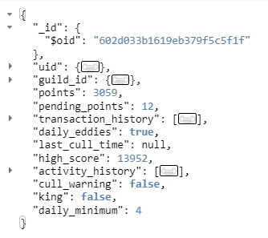
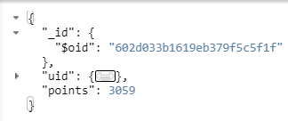

# BSEBot MongoDB

We'll explore how the bot interacts with our MongoDB instance.

## Overview

[MongoDB](https://www.mongodb.com/docs/manual/) is a NoSQL document-oriented database. A MongoDB instance can have many databases, and each Database is made up of multiple Collections. These Collections contain the Documents.


Each document in MongoDB is structured very similarly to a JSON file (picture is just an example - not our data).


We'll go over three of the four _CRUD_ (Create, Read, Update, and Delete) operations here too and how we use them.

- [MongoDB Docs](https://www.mongodb.com/docs/manual/introduction/)
- [MongoDB Query Operators](https://www.mongodb.com/docs/manual/tutorial/query-documents/)
- [MongoDB Update Operators](https://www.mongodb.com/docs/manual/tutorial/update-documents/)

## How _we_ use MongoDB

There is one primary database that we should concern ourselves with `bestsummereverpoints`. This is comprised of multiple collections like `userpoints` and `userbets`.

In the code, the files that interact with the database are in the `mongo` directory. We represent the various levels of the MongoDB hierarchy through dfferent classes and we'll dive into these as we go. We use the `pymongo` library for doing the actual interactions with MongoDB but we provide lots of absractions and wrappers around the core functions.

To sum up the below structure:

- `interface.py`
  - `BaseClass` (`baseclass.py`)
    - `BestSummerEverPointsDB` (`db_classes.py`)
      - `UserPoints`
      - `UserBets`
      - etc


### interface.py

This is the lowest level of abstraction we provide - it provides direct wrappers around commond `pymongo` methods. These functions are called by another level of abstraction and shouldn't need to be interacted with directly.

### BaseClass

`BaseClass` is our base class for interaction with MongoDB. It represents a `MongoClient` object.


````python
class BaseClass(object):
    """
    Base MongoDB DB Class. Provides basic method and properties that all other DB Classes will need.
    If not username or password is provided - authenticate without username and password.
    """
    def __init__(
        self,
        ip: str = "127.0.0.1",
        username: str = None,
        password: str = None
    ):
        """
        Constructor method.
        :param ip: ip of instance to connect to
        :param username: username to login to instance with
        :param password: password to login to instance with
        """
        self.cli = interface.get_client(ip, username, password)
        self._vault = None
````

By default, it assumes you're connecting to an instance running locally without a username and password. These values can be passed in if they're different though. The class provides wrappers around methods in `interface.py` using the MongoClient object it creates as `self.cli`.

### Database Classes

Every Database in our server is represented by a 'Database class'. These are stored in `db_classes.py`.

````python

class BestSummerEverPointsDB(BaseClass):
    """
    Class to represent the BestSummerEverPoints DB
    """
    def __init__(self):
        """
        Constructor method that initialises the DB object.
        """
        super().__init__()
        self.bse_db = interface.get_database(self.cli, "bestsummereverpoints")

    @property
    def database(self) -> Database:
        """
        Basic database property.
        :return:
        """
        return self.bse_db
````

They're very simple - on initialisation it gets a Database object from the Client saves that as `self.bse_db` (or whatever database the class is representing) and then we provide a `database` property that returns that value. This Database class inherits from `BaseClass` so that it gains access to all the methods `BaseClass` provides. Simple.

### Collection Classes

Following a similar pattern, each Collection in MongoDB is representing by a 'Collection class'. Most of the ones we'll interact with most are in `bsepoints.py`. Let's take a look at one.

````python
class UserPoints(BestSummerEverPointsDB):
    """
    Class for interacting with the 'userpoints' MongoDB collection in the 'bestsummereverpoints' DB
    """
    def __init__(self):
        """
        Constructor method that initialises the vault object
        """
        super().__init__()
        self._vault = interface.get_collection(self.database, "userpoints")
````

It starts simple - we define the class and inhereit from the relevant Database class (in this case `BestSummerEveryPointsDB`) so that it gains access to those methods (and the ones from `BaseClass` too) and the `self.database` property. On initialisation, we get a reference to the relevant collection and that's stored as `self._vault`.

After that, we can begin to define some class methods. These should be methods for retrieving particular sets of documents or executing specific queries. Good methods to add are queries that are going to need to be executed in multiple places. We'll look at some examples but first we should understand the basics of querying in MongoDB.

### MongoDB: Basic Queries

Querying is our first _CRUD_ operation - it's the _Read_. We can query MongoDB using documents. Using the shell, we would pass a document to the `find` method on a Collection to execute a query. With our Collection classes, we have a `self.query` method that we can invoke. This is defined in our `BaseClass`.

````python
def query(
    self,
    parameters: dict,
    limit: int = 1000,
    projection: dict = None,
    as_gen: bool = False
) -> Union[list, Cursor]:

    if self.vault is None:
        raise NoVaultError("No vault instantiated.")
    return interface.query(self.vault, parameters, limit, projection, as_gen)
````

I've left out the doc string to keep it simpler. As we can see, it simply takes the parameters we give it and calls the `interface.query` function. The purpose is for it to be a wrapper that checks we have a Collection (vault) instantiated. The first argument that `query` expects is _parameters_. This should be a dict (doc) made up of key/values where the keys match keys in the Collection that you want to query against and the values match values you're searching for.

For example:

````python
def find_user(self, user_id: int, guild_id: int, projection=None) -> Union[dict, None]:
    """
    Looks up a user in the collection.

    :param user_id: int - The ID of the user to look for
    :param guild_id: int - The guild ID that the user belongs in
    :param projection:
    :return: either a user dict or None if the user couldn't be found
    """
    ret = self.query({"uid": user_id, "guild_id": guild_id}, projection=projection)
    if ret:
        return ret[0]
    return None
````

In our `find_user` method on our `UserPoints` class, we query the `userpoints` collection for a user matching that user ID and a guild matching that guild ID.

````python
from discordbot.constants import CREATOR, BSE_SERVER_ID
from mongo.bsepoints import UserPoints

user_points = UserPoints()
my_user = user_points.find_user(CREATOR, BSE_SERVER_ID)
````



Above is an example of using that method and what it would return. But what about the `projection` argument? Well, `projection` allows us to specify which fields we want to return - sometimes we don't want or need the entire document. Especially if those documents can be quite large. Similarly to the query filter parameters - we create a document with keys matching the Collection keys - except we can use True/False as the values. True will return a value and False will not.

Using the same query as above:

````python
projection = {"uid": True, "points": True}
my_user = user_points.find_user(CREATOR, BSE_SERVER_ID)
````



As you can see, this time we got a much smaller document. One thing to note with projections, if you specify as some fields as `True`, then MongoDB will interpret that to mean that all other fields _should **not**_ be returned. And vice versa, if you specify `False`, MongoDB will interpret that to mean all other fields _should_ be returned. You cannot use both `True` and `False` together in a projection.

That's the very basics of executing simple queries - let's move on to more examples.

### UserPoints Examples

#### get_user_points

This method exists purely for returning the number of eddies a user has - note the use of `projection` here too.

````python
def get_user_points(self, user_id: int, guild_id: int) -> int:
    """
    Returns a users points from a given guild.

    :param user_id: int - The ID of the user to look for
    :param guild_id: int - The guild ID that the user belongs in
    :return: int - number of points the user has
    """
    ret = self.query({"uid": user_id, "guild_id": guild_id}, projection={"points": True})
    return ret[0]["points"]
````

#### get_all_users_for_guild

This method returns all the users in the Collection for a given guild ID. Note the use of `projection` here to simplify the data returned. However, the method is open in that it would allow the code to specify a desired projection if different results are required.

````python
def get_all_users_for_guild(self, guild_id: int, projection: Optional[dict] = None) -> list:
    """
    Gets all the users from a given guild.

    :param guild_id: int - The guild ID to get users for
    :param projection: dict - The projection if any. Will use default if None
    :return: list of user dictionaries
    """

    if projection is None:
        projection = {"points": True, "uid": True, "daily_minimum": True, "high_score": True, "inactive": True}

    ret = self.query(
        {"guild_id": guild_id},
        projection=projection
    )
    return ret
````

### Updating documents with MongoDB

One other _CRUD_ operation we need to familiarise ourselves with is _Update_. Updating documents is important and we do it fairly frequently throughout the code. For us, it's a simple as using the `self.update` method on the Collection classes - and most of them provide methods for updating various keys and values anyway. Continuing our use of looking at the `UserPoints` class - let's have a look at using the `update` method.

````python
def set_points(self, user_id: int, guild_id: int, points: int) -> UpdateResult:
    """
    Sets a user's points to a given value.

    :param user_id: int - The ID of the user to look for
    :param guild_id: int - The guild ID that the user belongs in
    :param points: int - points to set the user to
    :return: UpdateResults object
    """
    ret = self.update({"uid": user_id, "guild_id": guild_id}, {"$set": {"points": points}})
    return ret
````

This method wants to set the amount of eddies the user has. It calls the `update` method with two parameters. The `update` method takes two arguments:
- the document filter to find documents to apply the changes to
- the update parameters


The first is easy - we've seen it before when using `query`. The second, is similar but there's some differences. This is a dictionary where the first set of keys are update operators - so MongoDB knows how to apply the changes we want to make. The value of each key is another dictionary where the keys of that are the fields in the Collection we want to update, and the values are the values we want to update to.

There are multiple different `update` operators but these are the main ones that we use:
- $set
- $inc
- $push

Let's go through them.

#### $set

This one is self-explanatory - it sets the value of the field(s) to the given value. `set_points` above is an example of that.

#### $inc

Short for 'increment'. This increments the value of the field(s) by the given amount.

````python
def increment_points(self, user_id: int, guild_id: int, amount: int) -> UpdateResult:
    """
    Increases a user's points by a set amount.

    :param user_id: int - The ID of the user to look for
    :param guild_id: int - The guild ID that the user belongs in
    :param amount: int - amount to increase pending points by
    :return: UpdateResults object
    """
    ret = self.update({"uid": user_id, "guild_id": guild_id}, {"$inc": {"points": amount}})
    return ret
````

Our method `increment_points` demonstrates this - it increments a user's eddies by the given amount.

#### $push

Push is useful - it adds a value to an array for the given fields.

````python
def append_to_transaction_history(self, user_id: int, guild_id: int, activity: dict) -> None:
    self.update({"uid": user_id, "guild_id": guild_id}, {"$push": {"transaction_history": activity}})
````

`append_to_transaction_history` is an example of us using that operator.

### Creating documents

_Create_ is the final _CRUD_ operation to cover. This again, is rather simple. All of our Collection classes have a `insert` method thanks to inheriting from `BaseClass`.

````python
def insert(self, document: Union[dict, list]) -> list:
    """
    Inserts the given object into this class' Collection object.
    :param document: document(s) to insert as dict or list of dicts
    :return: list of inserted IDs
    """
    if self.vault is None:
        raise NoVaultError("No vault instantiated.")
    if not isinstance(document, (list, dict)):
        raise IncorrectDocument("Given document isn't a dictionary or a list.")
    elif isinstance(document, list) and not all([isinstance(k, dict) for k in document]):
        raise IncorrectDocument("Not all documents in the list are dictionaries.")
    rets = interface.insert(self._vault, document)
    return rets
````

This is the method that's defined in `baseclass.py`. It takes one argument - 'document'. This should either be a dictionary (for single document insertion) or a list of dictonaries (for multiple document insertion).

Here's an example from `UserPoints` again

````python
def create_user(self, user_id: int, guild_id: int, dailies: bool = False) -> None:
    """
    Create basic user points document.

    :param user_id: int - The ID of the user to look for
    :param guild_id: int - The guild ID that the user belongs in
    :param dailies: bool - whether ther user should get daily eddies messages
    :return: None
    """
    user_doc = {
        "uid": user_id,
        "guild_id": guild_id,
        "points": 10,
        "pending_points": 0,
        "inactive": False,
        "daily_minimum": 5,
        "transaction_history": [],
        "daily_eddies": dailies,
        "king": False,
        "high_score": 10
    }
    self.insert(user_doc)
````

This is our method for creating a basic user (when the bot has been installed on a new server, new DB instance (when testing) or someone joins the server) with all the default values.

### More complicated searches

Sometimes, we want to do more than just filter documents based on equality to particular values. Similarly to `update`, there are 'query operators' that allow us to perform more complex queries. For examples on these, we have to use a different Collection classes.

### Summary

That's the basics of MongoDB and how we use it.
