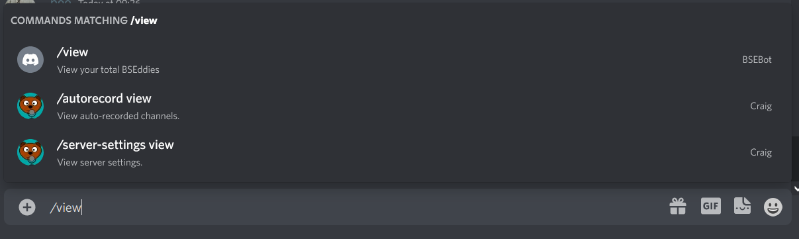
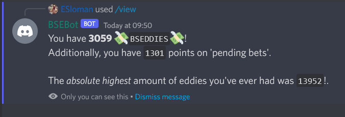

# BSEBot Overview

The aim of this file is to provide a high-level overview of BSEbot's purpose, functionality and how it does all the former. There will be separate documents that provide more in-depth technical information.

## BSEBot Purpose

The primary purpose of BSEBot is to run the 'BSEddies' (eddies) system that the Best Summer Ever (trademark pending) server uses. The eddies system allows users to gain 'eddies' (a fictional currency) and then use those eddies to bet on various things.
Using Discord Slash Commands, users can create bets, place eddies on bets, close bets, etc.

Every day, users will earn eddies through a 'daily salary'; this salary is determined by the user's interactivity in the server. Users who use the server more will naturally gain more eddies passively than others.

The bot does have other functionality - but this is secondary to the primary purpose. This includes the Valorant after-work call-to-arms and also the mute reminder in spoiler threads.

## Technical Overview

The bot is written in Python (`3.9+`) and is deployed via Docker Image to an EC2 AWS instance running in EU West (London). The bot's database is a MongoDB server instance running in a Docker container on the same EC2 instance.

The code relies on the Python library `py-cord` for all of it's interactions with Discord. This framework was chosen due it's ongoing support and it being relatively up to date with the official Discord API.

MongoDB was chosen due it's flexibility - it's a NoSQL DB and it's documents are structured similarly to JSON documents. Document keys can be created dynamically which makes it easy for us to add new keys to tables as needed.

### Discord Slash Commands

The bot heavily relies on Discord Slash Commands for it's core functionality.
- [Discord developer page on slash commands](https://discord.com/developers/docs/interactions/application-commands)
- [Pycord documentation on slash commands](https://guide.pycord.dev/interactions/application-commands/slash-commands/)

Slash commands allow a user to give the bot a command without actually sending the message. The user simply types `/` followed the name of the command (ie, `/<COMMAND>`). Slash commands do allow parameters too and slash commands make it easy to validate the inputs and make sure the user provides all the information they need to. I think they're great and they suit our purposes perfectly.

### Pycord tasks

The bot runs an `asyncio` loop that listens for Discord events and then calls the appropriate bit of code to handle that event. It is therefore not possible for us to natively have some code that says

````python
if time.now() == time_we_want_to_trigger_something:
    do_something()
````

To trigger events that happen at particular times (like, a morning 'good morning message' for example) or at set intervals (like checking who should be King) we must use `pycord`'s tasks (Cogs). We use these extensively for various tasks and we'll go into them in detail at another point. All the tasks are in the `discordbot/tasks` directory.

### Code overview

We will now go through the code - trying to keep the explanation brief and linking to other documents that provide more details.

The code is separated into three primary folders:
- `apis`
- `discordbot`
- `mongo`

The `apis` folder contains API classes for interacting with third party sites or services.  
The `discordbot` folder contains the code python code that runs the bot.  
The `mongo` folder contains DB API classes for interacting with our database.

The bot is started by running the `discordbot/main.py` file. This reads the parameters from the `.env` file located in the same directory. The code will create an instance of a `discord.Bot` class, which allows us to interact with Discord, and a `commandmanager.CommandManager` class that adds our desired functionality. The code then starts the asyncio listening loop that connects to Discord and listens to events.

#### Logging

A note on logs. In `main.py`, we create a Python `logging` logger object. This logger is setup to log how we want it to and logs to both stdout and to a file. We pass the same logging object to the various classes throughout the codebase. We can add information to the logs by using `self.logger.info` in most places (rather than `print`). It's a standard python Logger so other log types are available (`self.logger.debug`, `self.logger.exception`, etc).

### Core concepts

The BSEBot works and interacts with Discord by listening for events. Everything that happens in Discord (like a message being sent, someone reacting to something, creating a channel, using a slash command, etc) is an event. We can add 'event listeners' to handle particular events - the `pycord` framework will then invoke our code when it receives an event of that type. The code uses coroutines and an asynchronous framework that allows it to process multiple things (like events) simultaneously.

Similarly, within the code (and using the `pycord` framework), we can register the Slash Commands (and other Application Commands - but on to that later) and then when one of our commands is invoked by a user - the framework will invoke the code that we designated as it's callback.

The [pycord reference on discord events can be found here](https://guide.pycord.dev/interactions/application-commands/slash-commands/). This lists all the supported events in the framework. The events listed are vast and there's lots of 
different things that we can use to trigger code.

An example of an event that we subscribe to is the [`on_ready`](https://guide.pycord.dev/interactions/application-commands/slash-commands/) event. This event is triggered when the bot has logged in and is ready to start to receiving events. This is how we register the event listener:

````python
@self.client.event
async def on_ready():
    """
    Event that handles when we're 'ready'
    :return:
    """
    await self.on_ready.on_ready()
````

We create a function that has a name that's the same as the event we want to register too (in this case `on_ready`) and then decorate it with the `@self.client.event` decorator that tells the framework we want to listen for this event. The code in the function is what gets invoked when Discord sends that event.  
In this case, we call the `on_ready` function on our `on_ready` class. I know, I know, we've said `on_ready` a lot in that code and we'll move on to explaining how this pieces together.

### BSEBot code principles

The code is separated out to avoid having really large files. This means that I try to separate code out into separate files and classes wherever possible. This is most easily seen when looking at the event listeners. In `main.py`, which is our primary entry point for the bot, we instantiate our our Discord Bot object.

````python
cli = discord.Bot(debug_guilds=IDS, intents=intents, activity=listening_activity)
com = CommandManager(cli, IDS, logger, beta_mode=BETA_MODE, debug_mode=DEBUG_MODE, giphy_token=GIPHY_TOKEN)
````

`discord.Bot` is the `pycord` Bot API class that handles events and interacting with Discord for us. We also instantiate a class called `CommandManager` - and the first parameter we give it is our `discord.Bot` object. This `CommandManager` is defined in `discordbot/commandmanager.py` and 'manages' our commands.  

Every event that we listen for has a corresponding 'Event Class'. These event classes get instantiated by the `CommandManager` and then it references them when it registers all of the event listeners. The event classes allow us to inherit from a base `BaseEvent` class which contains shared methods and variables that all of the events will rely on - typically these are instances of our database or API classes.

For example,

In `discordbot/clienteventclasses.py` (where we define our event classes for client events), we have a `OnReadyEvent` class. It has one method called `on_ready` that contains all of the logic we want to perform when the bot is first started and has successfully connected to Discord.

````python
class OnReadyEvent(BaseEvent):
    """
    Class for handling on_ready event
    """
    def __init__(self, client: discord.Bot, guild_ids, logger, beta_mode=False):
        super().__init__(client, guild_ids, logger, beta_mode=beta_mode)
        # init logic here

    async def on_ready(self) -> None:
        """
        Method called for on_ready event.
        :return: None
        """
        # logic here
````

In `CommandManager` we create an instance of it in `__init__`:

````python
self.on_ready = OnReadyEvent(client, guilds, self.logger, self.beta_mode)
````

and then, when we register our event listener for the `on_ready` event (as we saw earlier), we call the `on_ready` method on our `on_ready` event class.

````python
@self.client.event
async def on_ready():
    """
    Event that handles when we're 'ready'
    :return:
    """
    await self.on_ready.on_ready()
````

This is how we handle every event we want to listen to and every event has a corresponding `EventClass`.

'Client' event classes are native Discord events (listed on the reference above). Slash commands are slightly different but each invoked slash commands triggers a 'slash command event' and we also have a corresponding `BSEddies` slash command event class in `slashcommandeventclasses.py`.

### Slash Commands Overview

We'll have a quick look at an example of a Slash Command to demonstrate how similarly they are handled to Discord events. Let's take the most basic of all our Slash Commands - `/view`. This code can be found in `CommandManager`.

````python
@self.client.command(description="View your total BSEddies")
async def view(ctx: discord.ApplicationContext) -> None:
    """
    Slash command that allows the user to see how many BSEddies they have.
    :param ctx:
    :return:
    """
    await self.bseddies_view.view(ctx)
````

Similarly to events, we create a function and then decorate it with a function decorator. This time, instead of `client.event`, it's `client.command`, and we can pass in parameters to this function too. This decorate will take the function name, `view` and turn it into a Slash Command called `/view`. It will also take the description and add that as a description to the Slash Command in Discord. The decorate will also use the actual function arguments to create Slash Command parameters but we'll touch on that later. The first argument in our `view` function (and all Slash Commands) is the `discord.ApplicationContext` object - this object contains useful context about who/what/when invoked the command.

In Discord, that looks like:



Like our events, we have a `bseddies_view` class instantiated here

````python
self.bseddies_view = BSEddiesView(client, guilds, self.logger, self.beta_mode)
````

This class is defined in `slashcommandeventclasses.py` and contains the actual logic for handling the event. It's relatively simple - this is the output when a user invokes the command:



We'll go into more detail about these elsewhere.

### Tasks

As we mentioned earlier, we use 'Tasks' to create ongoing events. The various tasks are defined in the various files in `discordbot/tasks`. Each task has it's own file. The `CommandManager` class creates an instance of each of these tasks when it is started.

[Py-Cords task reference is here](https://guide.pycord.dev/extensions/tasks/).

We'll have a quick look at a fairly basic one - the **Daily Valorant Task**. The purpose of this task, is to send a message on weekdays asking if anyone is playing any 'after-work' Valorant in the `valorant-chat` channel. This was something I did everyday, but it's far easier to get a bot to do it. The task is defined in `dailyvallytask.py`.

As you can guess - each task is a class.

````python
class AfterWorkVally(commands.Cog):
    def __init__(self, bot: discord.Client, guilds, logger):
        self.bot = bot
        self.logger = logger
        self.guilds = guilds
        self.vally_message.start()

    def cog_unload(self):
        """
        Method for cancelling the loop.
        :return:
        """

    @tasks.loop(minutes=10)
    async def vally_message(self):
        """
        Loop that makes sure the King is assigned correctly
        :return:
        """

    @vally_message.before_loop
    async def before_vally_message(self):
        """
        Make sure that websocket is open before we starting querying via it.
        :return:
        """
````

I've left most of the method bodies empty to make it a bit simpler.
So from the top, we define a class `AfterWorkVally` (the name of a task doesn't matter) and it inherits from `commands.Cog` (important). The class has three methods:
- `cog_unload`
- `vally_message`
- `before_vally_message`

#### vally_message

Let's start with `vally_message`. This is our primary logic that we want to execute. The name of the function doesn't _really_ matter. As you can see, we have another function decorator! This decorator, `tasks.loop`, tells the framework that this function is a task and must be invoked on an interval. In the parameters for the decorator, we tell it how frequently we want our task to be executed (in this case ten minutes). 

A task is executed once when the bot first starts, and then at the set interval we've set. So if the bot was started at 7:06AM, the vally task would first run then and then every ten minutes thereafter: 7:16, 7:26, 7:36, etc.

_Generally_, if I want something to happen at a specific time, I loop it by X minutes and then check the time within the function itself. Like, I only want the Valorant message happening sometime shortly before 4pm (and only on weekdays), so the start of that function looks like:

````python
now = datetime.datetime.now()

if now.weekday() not in [0, 1, 2, 3, 4]:
    return

if now.hour != 15 or not (45 <= now.minute <= 54):
    return
````

We grab the current date and time - and first check that the day is a weekday. If it's not, we simply return and do nothing. Then, we check the time. Firstly, we check to see if it's 3pm - if it's not, we return immediately and do nothing. We also check that the minute is within `45 - 54`. This is because we're on a ten minute loop so anytime between then is fine.

I'm using a ten minute loop because I don't _need_ to execute this every minute and for 99.9% of the time for it to be doing nothing. This is _still_ doing nothing most of the time but it's executing ten times less than before so it's a little less wasteful of resources. If I upped the time to an hour then that doesn't work for me either as I want the message sent between 3:45pm and 4:00pm. Having an hour would mean that it would miss that interval completely if the bot was started at 0-44 minutes past the hour.

#### cog_unload

This is a simple method, and all of the tasks must have this. `cog_unload` is called then the task is cancelled and is effectively a way to cancel the loop.

````python
def cog_unload(self):
    """
    Method for cancelling the loop.
    :return:
    """
    self.vally_message.cancel()
````

As `vally_message` is a task, it's also defined as a class variable that has it's own methods as well. In this case, we call the `cancel` method on the task.

#### before_vally_message

This is again, a simple message, and all tasks must have a variant of this (typically `before_TASK_NAME`). 

````python
@vally_message.before_loop
async def before_vally_message(self):
    """
    Make sure that websocket is open before we starting querying via it.
    :return:
    """
    await self.bot.wait_until_ready()
````

Here we wrap the function in another decorator - this time derived from our task function. This decorator tells the task that this code must be executed before each loop. In this case, we're making sure that the bot is ready and connected to Discord before we do anything - otherwise the first loop of every task would fail immediately when it queries Discord.

We'll go into each detail about each task in another file.