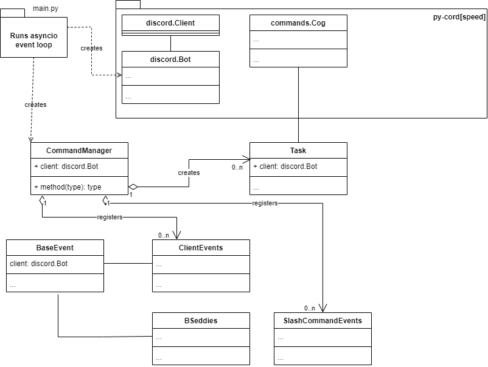

# Structure Overview

Attempt at a rough overview of how all the code is laid out.

## main.py

`main.py` is the entrypoint to our program; it serves to do three primary things:
- create the `discord.Bot` instance
- create the `CommandManager` instance
- start the loop that listens for events

## discord.Bot

`discord.Bot` is the [`pycord`](https://pycord.dev/) [`Bot`](https://docs.pycord.dev/en/stable/api/clients.html#discord.Bot) object. Calling the [`run`](https://docs.pycord.dev/en/stable/api/clients.html#discord.Bot.run) method on this class creates the event loop and will connect us to Discord's servers and listen out for events from Discord. We use this class for registering all our client events and application commands (slash commands). All of our API calls in events, commands, and tasks goes through this class. Referred to as `bot` or `client` throughout the code. Most event classes either have a `self.bot` or `self.client` attribute depending on how I named it.

## CommandManager

`commandmanager.CommandManager` is our class; it exists to provide a central place for registering tasks, client events, and application commands. That is it's sole purpose. The events and commands are connected to our `discord.Bot` instance which registers them all with Discord.
- Each client event has it's own file and class; these are imported and instantiated here
- Each application command has it's own file and class; these are imported and instantiated here
- Each task has it's own file and class, these are imported, instantiated, and started here

## Tasks

Tasks is code that runs at set intervals. Each task has it's own file and class that exists within the `discordbot/tasks` directory.

## Client events

Client events are Discord Events that we can respond to. These events are typically things that users do. Each client event has it's own file and class within the `discordbot/clienteventclasses` directory. Each client event class inherits from a `BaseEvent` sublcass that contains useful class variables; typically database classes they can use to query the various database collections.

## Application Commands (slash commands)

Slash commands are bot commands that we've written and registered. Each application command has it's own file and class within the `discordbot/slashcommandeventclasses` directory.

# Events delegation

