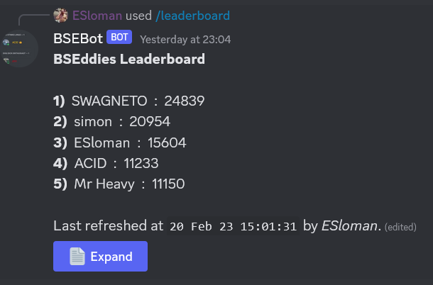

# UI Overview

This is an overview of the different UI elements in Discord and how we use them. As we rely on `pycord` as our Discord library - we can refer to their [UI guide](https://guide.pycord.dev/category/ui-components) for the various components as well.

## Different UI elements

UI elements in discord are relatively new and are somewhat limited - but they can be leveraged to do quite a bit. There are three main UI components:
- buttons
- select menus
- text fields

At the time of writing;

- Buttons and selects can only be used with `Views`.
- Text fields can only be used with `Modals`.

### Views

[Pycord docs on `views`](https://guide.pycord.dev/interactions#views). Views are effectively invisible placeholders within messages and we can add/remove buttons/selects from them. The easiest way to create views is the subclass the `discord.ui.View` and add buttons and selects to that.

A view has a maximum of **5** rows. Each row can be made up of **1** Select Menu or **5** buttons. Each message in Discord can have one view; therefore each message can have up to **5** Selects or **25** Buttons. Though the latter seems excessive. 

A very simple view might look like this:

```python
class LeaderBoardView(discord.ui.View):
    def __init__(self, embed_manager: EmbedManager):
        self.embeds = embed_manager
        super().__init__(timeout=None)

    @discord.ui.button(
        label="Expand",
        style=discord.ButtonStyle.primary,
        custom_id="leaderboard_button",
        emoji="📄")
    async def button_callback(self, button: discord.ui.Button, interaction: discord.Interaction) -> None:
        """
        Button Callback
        :param button:
        :param interaction:
        :return:
        """
        msg = self.embeds.get_leaderboard_embed(
            interaction.guild,
            None if button.label == "Expand" else 5,
            interaction.user.display_name
        )

        button.label = "Expand" if button.label == "Retract" else "Retract"
        await interaction.response.edit_message(view=self, content=msg)
```

This is our leaderboard `View`. It only contains one simple button.



It's super easy to create a new view instance (from the `discordbot/slashcommandeventclasses/leaderboard.py` file):

```python
leaderboard_view = views.LeaderBoardView(self.embed_manager)
await ctx.respond(content=msg, view=leaderboard_view)
```

All of our views can be found in the `discordbot/views` folder. Each view is it's own file/View class.

### Buttons

The `pycord` [docs](https://guide.pycord.dev/interactions/ui-components/buttons) on buttons.

Honestly, the docs above are far superiour than anything I would write; so refer to them. Most of our views also use buttons; so refer to those examples to see how we use them.

### Selects

The `pycord` [docs](https://guide.pycord.dev/interactions/ui-components/dropdowns) on select menus.

Again, the docs are far better. Refer to them for information. However, most of the time, we want our select options to be dynamically generated at the time a user invokes the slash command. This is tricky to do with the decorator notation, so we tend to sublcass `discord.ui.Select` and then use the `View.add_item` method to add the select to the view.

Each select has it's own class - these are defined in `discordbot/selects/` so refer to those for examples.


### Modals

Modals are the last UI element we can really take advantage of. `pycord` [docs](https://guide.pycord.dev/interactions/ui-components/modal-dialogs) on Modals.

Again, we tend to subclass the `discord.ui.Modal`. We currently have two modals; `/create` for bet creation and `/suggest` for suggesting a feature. The modals are defined in `discordbot/modals.py`. Currently both in the same file, but as we create more of them then we may refactor that to something similar to `views` or `selects`.
